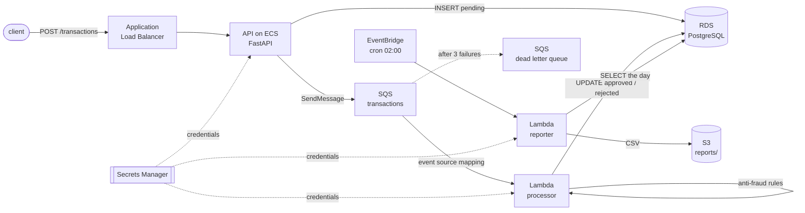

# aws-payments-floci

A transaction processing system shaped the way you would actually build one on AWS. An
API on ECS takes a payment, writes it as pending and publishes it; a Lambda applies
anti-fraud rules against the customer's recent history and settles the row in PostgreSQL;
messages nobody can parse are retried and then set aside in a dead letter queue; a
scheduled Lambda drops the day's transactions on S3 as CSV. Every piece of it is
Terraform, every role is scoped to one job, and the whole thing runs on a laptop with
nothing but Docker, because the AWS it talks to is [Floci](https://floci.io), a local
emulator. There is no account, no credential and no bill anywhere in this repository.

[](https://github.com/dimagrotser/aws-payments-floci/actions/workflows/ci.yml)

**[Test report](https://dimagrotser.github.io/aws-payments-floci/)**: unit, integration
and end to end results from the last run on main, in one Allure report.

## Architecture



The API answers immediately with `pending` and the decision arrives about a second later,
which is the point of splitting them: a card payment should not wait on a fraud check,
and a fraud check should not hold an HTTP connection open.

## Quickstart

```bash
make up           # start Floci (pinned to 2.1.0)
make deploy       # build and push the images, apply the stack, migrate the database
make test         # unit tests
make integration  # pytest against the running emulator
make e2e          # Playwright against the deployed API
make report       # merge both into one Allure report
```

You need Docker, [uv](https://docs.astral.sh/uv/) and Node. Terraform, tflint, checkov,
gitleaks and Allure all run from pinned containers, so there is nothing else to install
and CI runs the same versions you do.

## Trying it by hand

```bash
curl -s -X POST http://localhost:8088/transactions -H 'content-type: application/json' \
  -d '{"customer_id": "cust-1", "amount": "25000", "currency": "EUR", "country": "DE"}'
```

The answer comes back immediately with a transaction id and the status `pending`. A second
later the processor has had its say:

```bash
curl -s http://localhost:8088/transactions/<id>
```

Twenty five thousand euros is over the limit, so the transaction settles as rejected with
the rule that turned it down. The same answer is in the database:

```bash
export AWS_ENDPOINT_URL=http://localhost:4566 AWS_ACCESS_KEY_ID=test AWS_SECRET_ACCESS_KEY=test
PGPASSWORD=$(aws secretsmanager get-secret-value --secret-id payments-db/master \
  --query SecretString --output text | jq -r .password) \
  psql -h localhost -p 7001 -U payments -d payments \
  -c "select transaction_id, status, decision_reason from transactions"
```

Put something that is not a transaction straight onto the queue and watch it arrive in
`payments-transactions-dlq` about a minute later.

The daily report runs at 02:00 on a schedule, which is a long time to wait, so ask for a
particular day instead:

```bash
aws lambda invoke --function-name payments-reporter --cli-binary-format raw-in-base64-out \
  --payload "{\"day\": \"$(date -u +%F)\"}" /dev/stdout
aws s3 cp "s3://payments-artifacts/reports/$(date -u +%F).csv" -
```

Port 8088 for an API that listens on 80, port 7001 for a database that thinks it is on
5432, and `localhost` where the secret says `floci`. All three are explained below.

## What this demonstrates

**Infrastructure as code that someone else can read.** Seven Terraform modules, one per
component, each with its own variables, outputs and version constraints. `terraform test`
makes fifteen assertions about the configuration before anything is applied, tflint and
checkov run on every push, and the twenty five checkov findings that are deliberately
accepted are listed with a reason each in `.checkov.yml` rather than silenced.

**Least privilege that is actually enforced.** Every Lambda and the ECS task have a role
of their own, and Floci evaluates IAM policies for real. So the claim is testable: the
integration suite asks the IAM simulator whether the API can consume the queue it
publishes to, whether the processor can write reports, whether the reporter can read the
bucket back. All three answers are no, and widening a policy turns a test red. The ECS
task is the honest exception, and it is documented below rather than glossed over.

**No secret in the repository, and none in the state file either.** The database password
is generated by an ephemeral resource and handed to the instance and to Secrets Manager
through write-only arguments, so `terraform.tfstate` holds `null` where the password would
be. gitleaks runs on every push.

**Four levels of testing, each answering a different question.** Unit tests cover the
rules with no AWS anywhere near them. Integration tests drive the real emulator and wait
for real effects. `terraform test` catches configuration mistakes before they are applied.
End to end tests go through the API with Playwright and then check the other side
independently, in PostgreSQL with `pg` and in SQS with the AWS SDK, because an API that
reports success and a database that disagrees is the failure worth catching.

**An asynchronous system tested without sleeps.** Every assertion about an effect polls
with a deadline. The dead letter queue scenario is set up once in a module-scoped fixture,
because a redrive takes a minute of real time and paying that per assertion would be
careless.

**Idempotency where the delivery guarantee demands it.** SQS delivers at least once, so
the processor upserts rather than inserts, and a test submits the same transaction twice
to prove one row comes out.

## Where Floci differs from AWS

Floci is young, so before building anything on it I measured the seven things this
architecture depends on. Two of the answers changed the design.

| Question | Answer |
|---|---|
| Do returned URLs point somewhere reachable? | Only if you set `FLOCI_HOSTNAME`. |
| Does a zip Lambda run, and what endpoint does it see? | Yes, and `AWS_ENDPOINT_URL` is injected for you. |
| Is RDS a real PostgreSQL, and on which port? | Real `postgres:16.4`, on a proxy port, not 5432. |
| Can the API image be pushed to Floci's ECR? | Yes, straight from the host, no registry configuration. |
| Is an ECS task's port published on the host? | No, not when Floci itself runs in a container. |
| Does ELBv2 really route to ECS tasks? | Yes, including targets the ECS service registers itself. |
| Are IAM policies enforced? | For Lambda, genuinely. For ECS tasks, not at all. |

**RDS is not on 5432.** Floci runs a real `postgres:16-alpine` container and proxies to
it, and `DescribeDBInstances` returns a port out of the 7001 to 7099 range. So
`docker-compose.yml` publishes that whole range, `FLOCI_SERVICES_RDS_ENDPOINT_HOST` makes
the advertised address a name instead of a container IP, and host-side tests take the port
from the API and ignore the hostname.

**The ALB does route to ECS tasks, but its listener lives inside Floci.** This was the
open question, since Floci's ELBv2 documentation never mentions `ip` targets. Creating an
ECS service with a `loadBalancers` block registers the task address by itself and traffic
arrives. The listener binds a port *of the Floci container*, though, which is why compose
maps `8088:80` rather than publishing the task's own port. The load balancer's DNS name
does not resolve at all, so tests address the listener.

**Floci outlives itself.** The ECR registry and every database run in containers Floci
starts on its own, with their data in volumes of their own, so a repository survives
`docker compose down` and greets the next deploy with `RepositoryAlreadyExists`. `make
down` removes both the containers and the volumes, which is the only way a second
`make deploy` behaves like the first.

**IAM enforcement is real for Lambda and absent for ECS.** Floci ignores policies unless
`FLOCI_SERVICES_IAM_ENFORCEMENT_ENABLED` is set; with it on, a Lambda gets genuine
assumed-role credentials and a call outside its policy comes back `AccessDenied`. That is
what `tests/integration/test_least_privilege.py` leans on. ECS is the exception: vending
task-role credentials needs a helper image that is not published anywhere, and Floci falls
back to unrestricted credentials without a word in the logs. The task role is declared the
way it would be on AWS, but locally it constrains nothing, and this README would rather
say so than imply otherwise.

**Scheduled rules fire, but nothing can make them fire on demand.** Measured during the
spike: a `rate(1 minute)` rule invoked its target exactly a minute later, once. There is
no API to trigger a schedule and no inspection endpoint for EventBridge, so the daily
report rule is checked as configuration and the reporter is invoked directly in tests.

## Layout

```
src/payments/          domain rules, database access, the API, the two handlers
terraform/             root module, seven component modules, terraform test files
terraform/floci.tf     everything that exists only because the target is an emulator
tests/unit/            pytest, no AWS
tests/integration/     pytest against the running emulator
tests/e2e/             Playwright, API plus direct checks in RDS, SQS and S3
services/api/          the API image
scripts/               everything the Makefile calls
```

The reasoning behind the technology choices is in [DECISIONS.md](DECISIONS.md).
